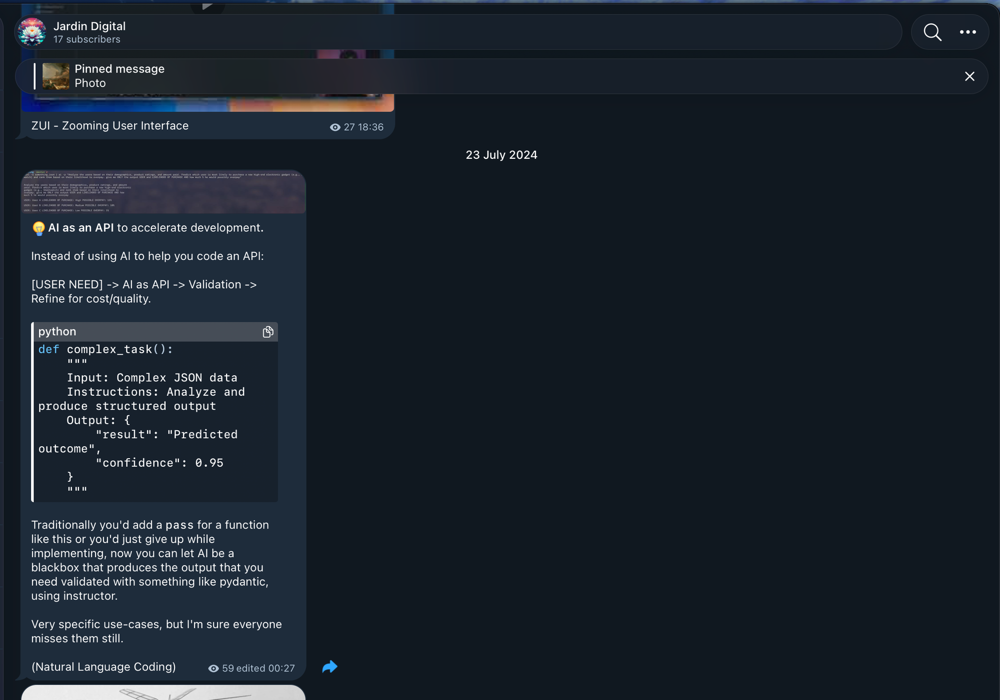

July 2024, [on my Telegram channel](https://t.me/jardindigital/236):



**Don't write the function. Describe it.** Let the model be the body, validate what comes back, refine for cost and quality.

The part that mattered was the last line of the output: `"confidence": 0.95`. An answer your code can act on, plus how much to trust it.

## 2025

Vercel opened [an issue for an AI CLI](https://github.com/vercel/ai/issues/6976). Guillermo asked for files, model switching and pipes. I [asked for one more thing](https://github.com/vercel/ai/issues/6976#issuecomment-3029520382): a schema, so the output is data you compose, not text you read.

```bash
curl -s https://acme.com/pricing | \
  npx ai "extract pricing tiers" --schema '{ "tiers": [{ "name": "string", "price": "number" }] }'
```

AI as an API blackbox, from the shell.

## 2026

Two weeks ago it got a name. **Decision models.**

TypeSafe shipped [Jev](https://simonwillison.net/2026/Sep/21/jev/), a model that doesn't write. State in, typed questions in, probabilities out. A yes/no with how likely it is. A choice with a distribution over the options. A score on a rubric. Nothing to parse, nothing to hallucinate.

Two days later Vercel's [ai-cli](https://github.com/vercel-labs/ai-cli) had it:

```bash
cat ticket.txt | ai evaluate \
  --boolean "refund=Refund requested?" \
  --choice "team=Which team?" \
  --choices "team=billing,support"
```

The first cut was even closer to the 2024 post: `git log | ai filter "describes a concurrency fix"`, `ai rank`, `ai pick`. Records in, records out, decided by meaning.

On Tuesday OpenAI announced a **Decisions API** at DevDay. Same shape: context in, predefined answers out, with a confidence.

## What I keep saying

The model is not the product. **The model is a function call.** The interesting part was never the prose, it was the typed answer and the number next to it, because that number is what lets code decide when to trust the answer and when to hand it to a person.

Two years from a Telegram post with 59 views to a product category.

I'm getting a bit tired of being early.
