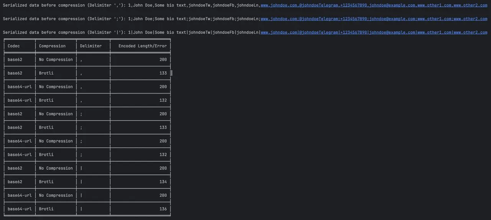

It was a Friday afternoon, I've spent the whole week reading Tip-Tap and ProseMirror docs to create the best self.fm editor... _ when my ADHD demon whispered_

> Can you create a link aggregator that stores no data?

Then I remembered about one of my beloved [e-ID](/blog/e-id) #side-quest

So it began...

# Ideation
I jumped into ChatGPT, and asked about the feasibility of my  plan, store all the user links in the URL slug.

After consulting about various encoding and compression options I went into the next phase.

# Experimentation

## Encoding
I tried all the encoding methods ChatGPT and I could think of, **base64-URL** produced the shortest URL-safe output.
## Compression
Brotli stood out as the most performant.
While I was at it I realised I could use wasm brotli to do all this without having to do the compression on the server, so I did.
## Serializing the data into a standarised array format
At first I was storing the whole dictionary like:
`{'version':'1','name':'Adrian Galilea'...}`

But I realised that if I created a standarised format I could save quite a bunch of characters that I didn't have to encode in the slug.
```javascript
export const orderedKeys1: (keyof UserProfile1)[] = [
  "version", // just in case I change fields later
  "name",
  "bio",
  "personalSite",
  "email",
  "telegramHandle",
  "twitterHandle",
  "instagramHandle",
  "facebookHandle",
  "linkedInHandle",
  "other",
];
```
_this method saved ~50% of char length_

UX:
1. fill-out the form
2. |> serialize the data into a standarized array format ['name', 'website', 'twitter', '...']
3. |> compress it using brotli
4. |> base64-url encoding so it's url-safe

input:
```
{
    "version": "1",
    "name": "Adrian Galilea",
    "bio": "Be a poem.",
    "personalSite": "https://adriangalilea.com",
    "email": "adriangalilea@gmail.com",
    "telegramHandle": "adriangalilea",
    "twitterHandle": "adrigalilea",
    "instagramHandle": "",
    "facebookHandle": "",
    "linkedInHandle": "",
    "other": ""
}
```

output:

```
G2wAYETdluo5XTCvqMWSB55zuCo65YC52oI6y40PRveUFZMlKA_tP1rR1w8emcxII4YJ5V3bBc-ZlpNx8NyN6NB8M7KQNaEo
```

URL:

[👤️️.to/G2wAYETdluo5XTCvqMWSB55zuCo65YC52oI6y40PRveUFZMlKA_tP1rR1w8emcxII4YJ5V3bBc-ZlpNx8NyN6NB8M7KQNaEo](https://e-id.to/ninja/G2wAYETdluo5XTCvqMWSB55zuCo65YC52oI6y40PRveUFZMlKA_tP1rR1w8emcxII4YJ5V3bBc-ZlpNx8NyN6NB8M7KQNaEo
)

All in all I'm happy with the result as I proved that it's feasible to store quite a bunch of data, here is the decoded data presented in e-ID:


Style points:
- brotli-wasm
- responsive website
- dark/light mode


Either way this does not fit with the vision I have for e-ID
- I want to provide readability, and clean URL's
  - [e-id.to/adrian](https://e-id.to/adrian)
  - [👤️.to/adrian](https://e-id.to/adrian)
- I want to allow statitic site generation, so it feels snappy.

So I archieved all of this under the /ninja/ path and preserved the code on the [open sourced repo](https://github.com/adriangalilea/e-id/ninja)

Shootout to [teito](https://www.teitoklien.com/)

Thanks for reading!

Time to focus on self.fm
