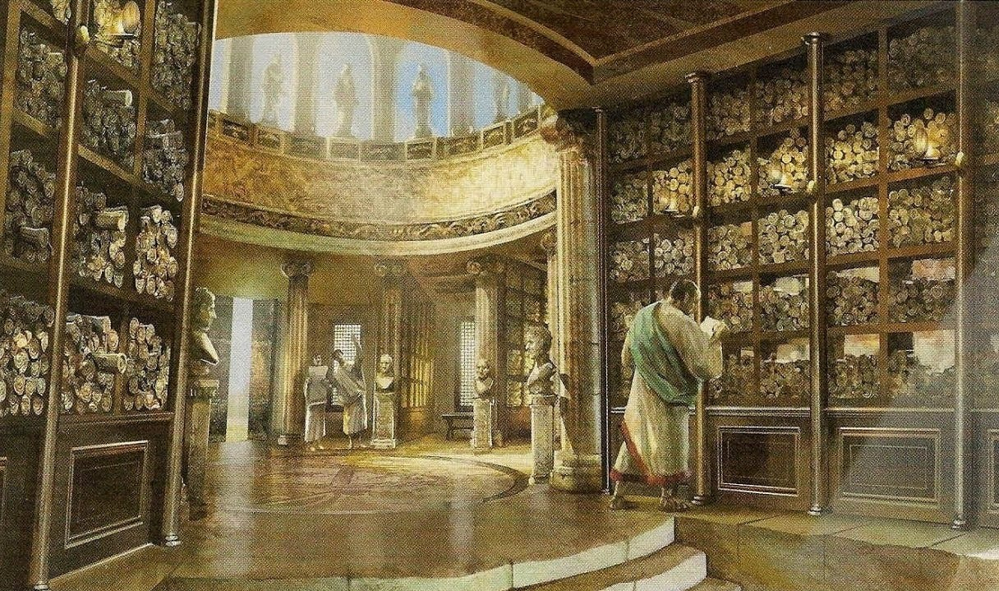
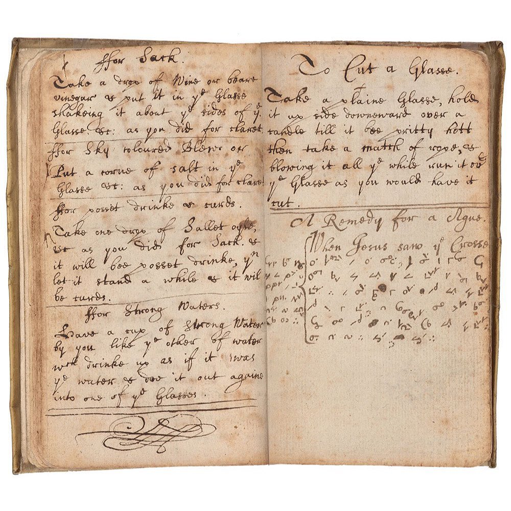

## Genesis
> In the beginning was the word
> - John 1:1

Poems and stories.
A *teller* and its *listener*.
A *master* and its *apprentice*.

**Knowledge was _local_**. **Speech was its medium.** **_Inaccessible_** if you couldn't listen to someone who knew.
Its fidelity was as **_fallible_** as the human mind.

> Necessity is the mother of invention
> - Plato

***The Written Text*** was born.

**What Plato forgot to mention is that each solution creates newer problems.**

> Wait... How do we organise all these books now?
> - Someone somewhere, a while ago, probably.

*The Library of Alexandria ~250 BC.*

And we began grouping, labelling... But with books neatly organized in categories, knowledge is stranded, starved, becomes stale.

*Slime mold ~~solving complex network optimization problems~~*

So, we began extracting, combining, and annotating knowledge from diverse sources, weaving webs of information with emergent practices such as the Commonplace Book.

*Sir Isaac Newton (1642–1727) kept this pocket-sized "memorandum book", filling it with notes distilled from his reading.*

## Digital Redux

> Thus science may implement the ways in which man produces, stores, and consults the record of the race.
> - Vannevar Bush

In "[As We May Think](https://en.wikipedia.org/wiki/As_We_May_Think)", 1945, [Vannevar Bush](https://en.wikipedia.org/wiki/Vannevar_Bush) imagined the **memex**, a personal library with associative trails between documents, mimicking the human mind but gifted with permanent recollection.

[Ted Nelson](https://en.wikipedia.org/wiki/Ted_Nelson) coined **hypertext** in 1963. His [Project Xanadu](https://en.wikipedia.org/wiki/Project_Xanadu) envisioned **transclusion**, documents embedding content from other documents, with two-way links and built-in attribution. The web we got is a shadow of that vision.

In 1987, [Bill Atkinson](https://en.wikipedia.org/wiki/Bill_Atkinson)'s [HyperCard](https://en.wikipedia.org/wiki/HyperCard) brought hypertext to the masses, stacks of linked cards that anyone could author. For the first time, the tools of associative knowledge weren't just imagined, they were *used*.

And then the web arrived. We got one-way hyperlinks. We got databases that silo knowledge into rigid tables. Yet again we improved distribution but lost the connection. The knowledge is stranded again.

> [Finished, thank god.](https://en.wikipedia.org/wiki/Colophon_(publishing)#cite_note-:0-9)
