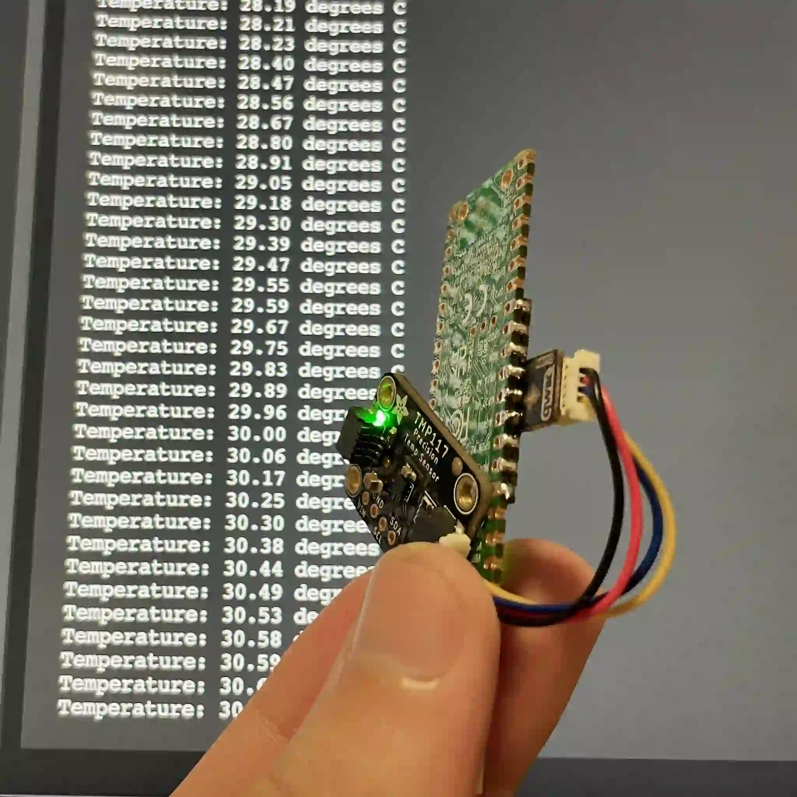

I always wanted to learn electronics, and I tried some old ESP32's, but the experience was awful, I wasn't familiar with the code and learning both electronics and a new programming language was boring...

One day Raspberry anounced the RPI pico W, to my surprise it was programmed in micropython, I was very excited... bought 1... I tried a few things, lighting a LED felt like too much power, I'm used to the magical powers of code, but interacting with the physical world through code hits different, then I bought 10 more...

Then I started buying sensors, lights, motors, pumps, from all kinds, I kid you not, I was so excited, and I loved every bit of it, minus the tedious aspect of soldering, using breadboards and so on, which felt like a drag in my quick adhd fueled iteration process, this is when I met qwiic, originally desgined from sparkfun, but widely used on adafruit products, of course I bought tons of these, and I loved it.

This is when I realized that the pico deserved to have qwiic and a reset button, those were the things that I constantly missed... this is when I reached out to [Simone](https://www.duppa.net), and we created:

Plug, Reset, and Prototype Effortlessly.

## Pico Pain Points
1. **Flash Mode**: Requires unplugging and holding BOOTSEL while you plug.
2. **Board Hangs**: Requires unplugging and plugging back in to reset.
3. **Prototyping**: Absence of a Qwiic/Stemma QT connector for easy module connection without soldering.

## 1.50€ Pico QwiicReset Addon Solution
Meet your new best friend for faster prototyping and smoother iterations. This cute little guy is packed with features you didn't know you needed but won't be able to live without:
- **Instant Reset**: A single button press does the trick.
- **Flash Mode**: Just press both buttons simultaneously.
- **Compact design**: No added bulk—just more functionality packed into your existing Pico setup.
- **Plug-and-Play Prototyping**: Equipped with a Qwiic/Stemma QT connector, say goodbye to soldering and hello to an expansive ecosystem of modules.

[purchase](https://www.duppa.net/shop/rpi-pico-reset-button-qwiic-connector/?v=04c19fa1e772)

[github repo with more details and projects](https://github.com/adriangalilea/pico_qwiic_addon/tree/main)